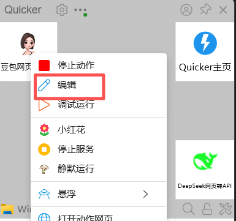
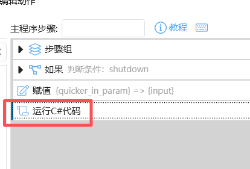
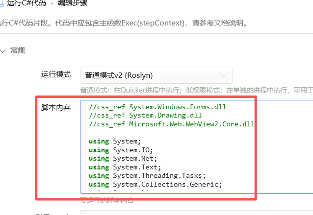

# Doubao DSH Plugin

[](https://www.npmjs.com/package/doubao-dsh-plugin)
[](https://github.com/Practice019/dsh-doubao-plugin/blob/master/LICENSE)
[](https://github.com/Practice019/dsh-doubao-plugin/releases)

DSH 插件：通过本地 Doubao Relay 提供 `doubao_ask` 动态搜索/图片生成/多模态识图工具，
并支持**粘贴图片 → 本地路径**（paste-to-path）。

## 功能

- 联网搜索/实时信息：调用 `http://127.0.0.1:56666/v1/chat/completions`。
- 图片生成：豆包返回的图片以 markdown 图片链接（``）放在 content 里，
  回复时保留即可在对话中直接显示。
- 多模态识图：传入 `image` 参数（http(s) 图片 URL / base64 data URL / 本地图片文件路径，
  本地图片超过 512KB 自动压缩到 800px 宽再发送），豆包识图后返回文字描述。
- **粘贴图片 → 路径（paste-to-path）**：复用 modlens 的验证实现。浏览器半部分（client.js）
  在捕获阶段拦截图片粘贴：先向 host 询问当前选中模型是否纯文本（GET `/doubao-paste?model=<标签>`，
  host 用真实模型元数据判定），确认后把图片字节 POST 到 `/doubao-paste`，
  保存为私有临时文件（`<temp>/doubao-dsh-paste/p-*/paste<ext>`，magic bytes 校验、25MB 上限、
  7 天 + 1GB 总量自动清扫），返回的**路径文本**插入输入框——文本模型不会触发
  "模型不支持图片"准入拦截。模型看到路径后调用 `doubao_ask` 并把 `image` 参数设为
  该路径即可让豆包识图。
- 图片自动去重：同一张图的多个 CDN 镜像/模板变体（水印/原图等）折叠为唯一链接，
  优先保留 `image_raw` 原图变体；无法接收的非 http(s) 占位链接自动剔除。
- 输出 `images` 字段：结构化返回去重后的图片列表 `[{ url, alt }]`。
- 每次请求强制 `"new_conversation": true`。
- 完整记录请求、响应等信息到日志和返回值。

## 安装

npm 一键安装：

```bash
dsh plugin --profile web add doubao-dsh-plugin
```

（本地开发路径安装：`dsh plugin --profile web add /path/to/doubao-dsh-plugin`）

安装后**重启 harness** 生效。

## 前置要求：Doubao Relay（Quicker 转发）

本插件所有能力（搜索/生图/识图）都通过本地 **Doubao Relay** 的 OpenAI 兼容接口
`http://127.0.0.1:56666/v1/chat/completions` 实现。**插件本身不包含 Relay**，
由 [Quicker](https://getquicker.net/) 软件把本地网页版豆包转发成 API 调用。

搭建步骤：
1. 安装 Quicker。
2. 下载共享动作：<https://getquicker.net/Sharedaction?code=dcb55394-707e-4255-ed26-08de36f81a8a>
3. ⚠️ 该动作年久未更新、存在 bug，需把 `c#code.txt` 中的代码替换到动作里（端口保持
   `56666`），替换后重新运行动作，Relay 即监听 `127.0.0.1:56666`。

替换代码的操作步骤：

1. 在 Quicker 托盘/动作上右键，选择**编辑**。
2. 在步骤列表中找到**运行 C# 代码**步骤。
3. 进入该步骤的编辑界面（运行模式选“普通模式 v2 (Roslyn)”），把 `c#code.txt` 中的
   代码**整体替换**脚本代码区，保存后重新运行动作。





未启动 Relay 时，工具调用会报 `Doubao Relay request failed`。

## 使用

1. 模型会自动看到工具 `doubao_ask`。
2. 直接把图片**粘贴**到输入框：图片会被保存为本地路径文本插入消息，发送后模型会用
   `doubao_ask`（`image` 参数 = 该路径）调豆包识图，把描述完整转述给你。
   ⚠️ 首次识图约需 15~20 秒（豆包 Relay 响应较慢）。
3. 也可以在对话里直接要求"搜索 X / 生成一张 X 的图"，模型会自动调用本工具。

## 参数

| 参数 | 类型 | 必填 | 说明 |
|---|---|---|---|
| query | string | 是 | 要搜索或询问的问题 |
| image | string | 否 | 要识别/分析的图片（URL / data URL / 本地路径） |
| system | string | 否 | 额外系统指令 |
| timeoutMs | number | 否 | 超时毫秒数，默认 90000 |

## 技术说明

- Host 半（`index.mjs`）：注册 `doubao_ask` 工具 + `/doubao-paste` 路由
  （经 `ctx.inject(['webServer'], ...)` 可选挂载，headless 环境自动跳过）。
- Client 半（`client.js`）：复用 modlens 的拦截逻辑——`document` 捕获阶段 `paste` 监听 +
  `focusin` 预取 verdict；host 判定当前模型纯文本后才接管（preventDefault → POST → 路径插入）。
  通过 `dsh.client` 声明（`exports["./client"]`）被 web 端加载。
- 改动后需重启 harness 生效（client bundle 在启动时扫描装配）。
